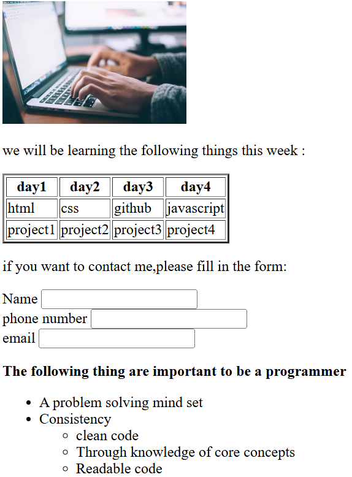

# Web Development Basics – Learning Project
 This project is a simple HTML webpage that demonstrates the fundamentals of web development,
 including images, tables, forms, and lists.--

 ## About the Project
 This webpage displays: - An image banner at the top - A table showing what will be learned each
 day - A simple contact form - A list of key traits required to become a good programmer
 It’s a beginner-friendly HTML exercise created to understand the structure and usage of common
 HTML elements.

 ## Features
 Displays an image using the  tag  Uses a table to show the weekly learning schedule 
Includes a form for user input (name, phone number, and email)  Demonstrates nested lists and
 proper use of headings and paragraphs

 ## Technologies Used- 
 HTML5 - Basic Inline Stylin

 # project screenshot
 

 
  
 